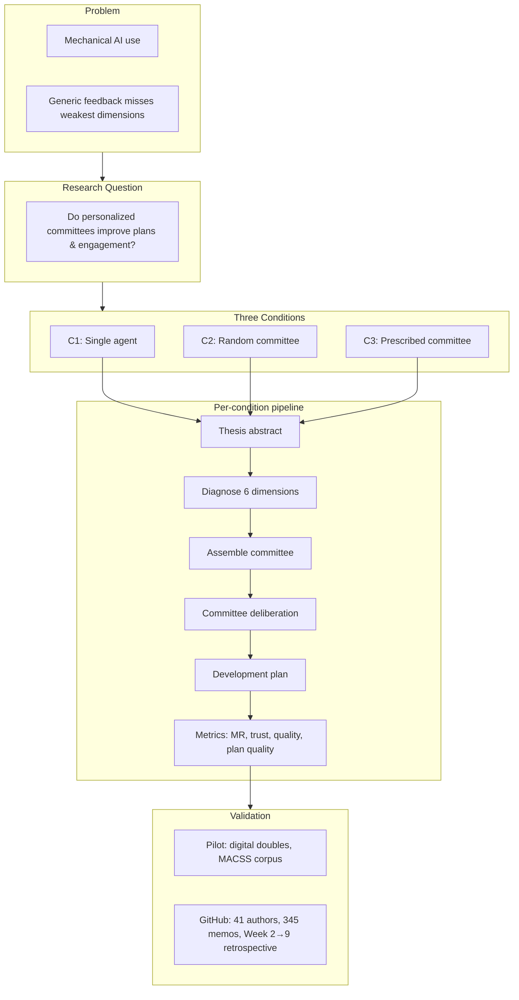
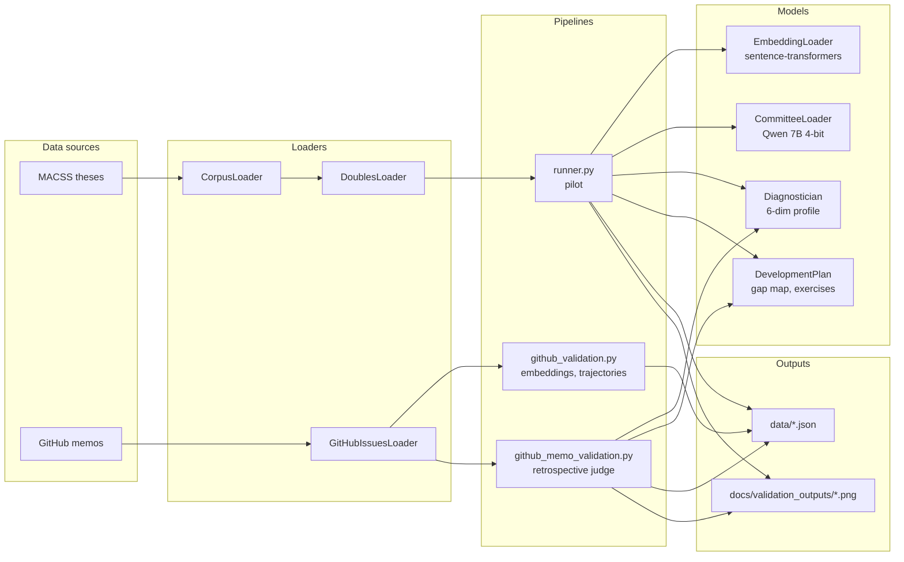

# It's the Student, Not the Thesis

**Personalized Adversarial Committees for Competency Development Against Mechanical AI Use**

We study whether **personalized committee feedback** (matched to a student's weakest competency dimensions) improves development plans and engagement compared to generic or random feedback. The project targets mechanical AI use by emphasizing substantive engagement.

This post explains the project and results: [Substack](https://open.substack.com/pub/afcamachob/p/its-the-student-not-the-thesis?r=n9f3p&utm_campaign=post&utm_medium=web)

---

## Research Design



**Six competency dimensions:** argument, evidence, methodology, theory, self-reflexivity, receptivity.

---

## Architecture



---

## What's Done

| Result | Description | Output |
|-------|-------------|--------|
| 2 | Qwen model comparison (0.5B / 1.5B / 7B) | `radar_by_model.png`, `radar_by_cluster.png` |
| 3 | Committee assembly demo | `committee_assembly_demo.png` |
| 4 | C1 vs C3 feedback comparison | `feedback_comparison_thesis_*.png`, `deliberation_thesis_*.png` |
| 5 | Development plan example | `development_plan_example.png` |
| 6 | Pilot (plan quality, feedback specificity) | `plan_quality_by_condition.png`, `feedback_specificity_by_condition.png` |
| 7 | GitHub retrospective (41 authors, 345 memos) | `github_improvement_heatmap.png`, `github_memo_validation.png` |

**GitHub findings:** Methodological reasoning improves most (4.15); self-reflexivity and scope harder (2.0–2.6). Per-author variation supports personalized feedback.

---

## How to Run

**Colab (recommended):** `memo_w9_integration.ipynb` — clone from GitHub, run cells, use Colab Secrets for `OPENAI_API_KEY` and `GITHUB_TOKEN`, download `colab_results.zip` before session ends.

**Local (uv):**

```bash
cd final-project
uv sync
uv sync --extra dev   # for pytest

uv run python run.py --pilot
uv run python run.py --pilot --github --fetch-corpus
uv run python run.py --full   # full experiment
uv run python run.py --fetch-github
uv run pytest tests/
```

*Note:* Result 2 (three Qwen sizes) needs significant GPU—Colab T4/A100 recommended.

---

## Outputs

| Path | Contents |
|------|----------|
| `docs/validation_outputs/` | All figures (radar, committee, feedback, deliberation, pilot, GitHub) |
| `data/` | `pilot_results.json`, `diagnostician_validation.json`, `github_memo_validation.json` |
| `figures/` | Pilot plots |

The notebook has a download cell that zips results for local use.

---

## Project Structure

```
final-project/
├── run.py                    # Entry: --pilot, --github, --fetch-corpus, --fetch-github, --full
├── memo_w9_integration.ipynb # Colab notebook
├── src/developing_the_researcher/
│   ├── config.py
│   ├── data/                 # corpus, loaders, github_loader
│   ├── models/               # embeddings, committee, diagnostician, development_plan, safety
│   ├── metrics/              # mechanical_reliance, trust, quality, deliberation
│   ├── pipeline/             # runner, github_validation, github_memo_validation
│   └── analysis/             # diagnostician_validation, feedback_comparison, etc.
├── data/                     # MACSS, GitHub, pilot results (generated)
├── docs/validation_outputs/  # All validation figures
├── presentation/             # SLIDES.md, NARRATIVE.md, SCRIPT.md
└── report.md                 # Implementation details
```

---

## Requirements

- **Data:** MACSS theses (OAI-PMH/HTML), GitHub memo comments (optional)
- **Models:** Qwen2.5-7B (4-bit), sentence-transformers, GPT-4-mini (GitHub validation)
- **Validation:** Pilot metrics; GitHub retrospective ( ecological validation only—no treatment deployed)

See [report.md](report.md) for full implementation details.
