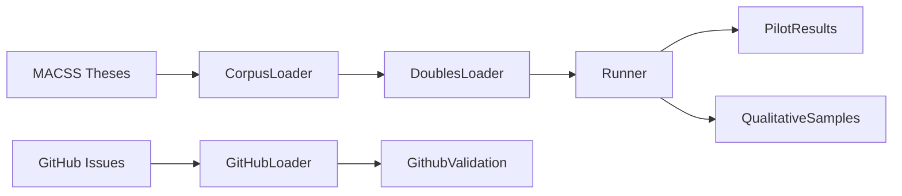

# Safe to Be Challenged — Project Brief for Claude Desktop

Project brief: what we have built, why we came to this project based on the memos, the logic behind it, and what we intended. No integration targets—let the other Claude agent decide options.

---

## 2.1 Project Identity

- **Name:** Safe to Be Challenged
- **Subtitle:** Trust and Harmlessness in Adversarial AI Advising
- **Research question (current):** Does making harmlessness monitoring visible change reliance and engagement when students receive adversarial feedback?

---

## 2.2 What Is Built (Implementation Summary)

- **Pipeline:** `run.py` — `--pilot`, `--github`, `--fetch-corpus`, `--fetch-github`
- **Flow:** Fetch corpus (optional) → Run pilot (`run_pilot`) → GitHub validation (optional)
- **Package:** `safe_to_be_challenged` in `src/`; config, data, models, metrics, pipeline

---

## 2.3 Data Pipeline

- **MACSS:** `data/macs_theses.json` (OAI-PMH or scraper), `abstracts_for_steering.json`
- **GitHub:** `data/github_issues.json` — "Week N Memo" comments; `github_validation.json` — trajectories
- **Pilot:** `pilot_results.json`, `qualitative_samples.json` (feedback–revision pairs)

---

## 2.4 Key Components

| Component | File | Purpose |
|-----------|------|---------|
| CorpusLoader | data/loaders.py | Load/fetch MACSS; fallback to SAMPLE_ABSTRACTS |
| DoublesLoader | data/loaders.py | Build doubles: thesis, condition, trust_sensitivity, methodology |
| GitHubIssuesLoader | data/github_loader.py | Fetch "Week N Memo" via GitHub API; cache |
| CommitteeLoader | models/committee.py | skill_diagnostician, adversarial_critic, generate |
| SafetyLoader | models/safety.py | judge_safety_llm, harmlessness_monitor |
| EmbeddingLoader | models/embeddings.py | get_embeddings, cosine_sim |
| run_pilot | pipeline/runner.py | Full experiment loop; saves results + qualitative samples |
| run_github_validation | pipeline/github_validation.py | Embed memos, compute trajectories |

---

## 2.5 Three Conditions

- **committee_only:** Raw feedback, no monitor
- **silent_monitor:** Monitor softens if unsafe; no label
- **visible_label:** Monitor softens + adds "verified constructive" label

---

## 2.6 Metrics

- Mechanical reliance (cosine sim: revision vs baseline)
- Trust (LLM-rated engagement 1–5)
- Quality (LLM-rated revision 1–5)

---

## 2.7 How to Run

- **Local:** `uv sync`, `uv run python run.py --pilot`, `uv run pytest tests/`
- **Colab:** `memo_w9_integration.ipynb` with `pip` in cells

---

## 2.8 Why We Came to This Project (From the Memos)

**Week 8 memo (Seeing the Student):** Shifted from critique quality to *diagnosis* and *evaluation*—what does the student actually need? Introduced digital doubles with known skill profiles, Ludwig-style discovery, and a ReAct-based advisor with personas (Skill Diagnostician, Theorist, Methodologist, Bias Auditor). Target: reduce mechanical reliance via skill-targeted feedback.

**Week 9 memo (Safe to Be Challenged):** Built on Week 8. Key insight: adversarial critique risks disengagement—students may distrust aggressive AI and copy-paste. Russell (2021): beneficial AI should remain uncertain about human objectives. Gabriel et al. (2025): transparency and human oversight as preconditions for trust. **Operationalization:** A *visible harmlessness guarantee* unlocks trust. Three conditions: (a) committee only, (b) silent monitor, (c) visible label. DVs: skill acquisition, trust, mechanical reliance. Predicted: visible label dominates.

**Logic behind the project:** Diagnosis alone is not enough—the system must teach through gaps. But adversarial teaching without safety assurance causes disengagement. The harmlessness monitor (LLM-as-judge, soften-if-unsafe) plus *visible* labeling addresses both: we keep adversarial quality while building trust so students engage rather than copy-paste.

**What we intended:** A self-contained pipeline using free models (Qwen 4-bit, sentence-transformers), MACSS theses as thesis data, GitHub "Week N Memo" comments for longitudinal validation, and qualitative feedback–revision pairs for interpretation. No paid APIs. The other Claude agent can decide how to extend or integrate this with alternative visions (e.g., development plans, persona pools, prescribed adversarialism).

---

## 2.9 File Map (Quick Reference)

- `run.py` — Entry point
- `src/safe_to_be_challenged/` — Package
- `data/` — Generated at runtime
- `tests/` — Unit tests
- `report.md` — Implementation rationale
- `claude-context.md` — Course context (this doc's companion)
